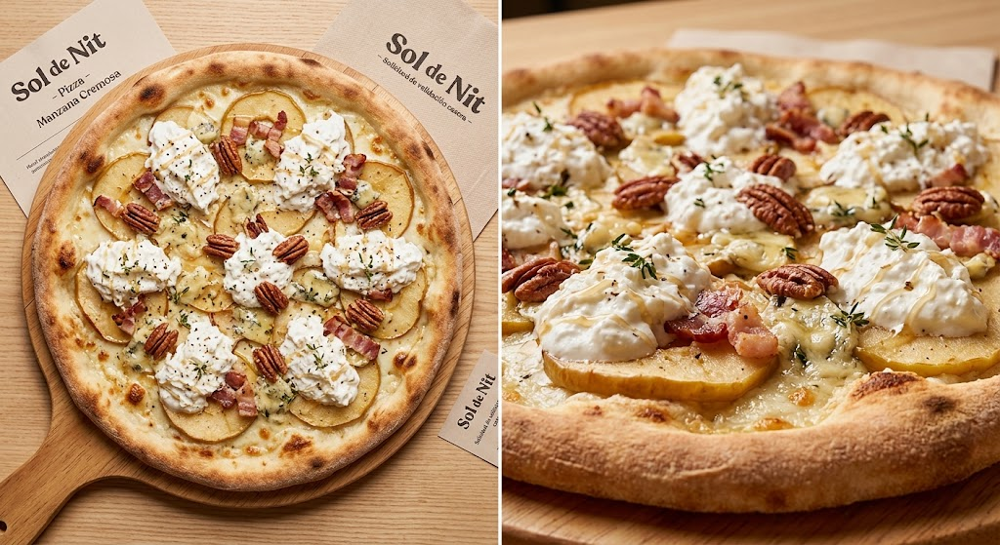

# 🍕 Ficha técnica — Pizza "Manzana Cremosa"

| | |
|---|---|
| **Categoría** | Pizza premium (temporada manzana sep-ene) |
| **Origen** | Brainstorming 2026-09-04 → variante 18.2 |
| **Estado** | 🟡 **Pendiente validación casera** por David. Ficha completa (producción) lista para implementar tras validación. |
| **Métodos creativos aplicados** | Simbiosis dulce/salado (manzana asada + gorgonzola) · Nueva manera de servir (stracciatella rota en mesa) · Adaptación (técnica italiana con queso azul del Piamonte) |

---

## 1. Concepto

Pizza blanca sobre base de **manzana asada** y **gorgonzola**, terminada con **stracciatella cremosa**, **nueces pecanas** y un **hilo fino de miel**. El contraste dulce-salado-amargo (la manzana aporta el dulce y un toque ácido, la miel el dulzor concentrado, el gorgonzola la salinidad) equilibra la riqueza del queso azul y la untuosidad de la stracciatella. Pizza de temporada (manzana sep-ene), con rotación natural. **El amargor de la mostaza de Dijon que se propuso inicialmente se sustituyó por miel tras feedback de David en brainstorming** — la miel es el acompañante clásico piamontés del gorgonzola y aporta menos riesgo para clientela de pizzería italiana.

---

## 2. Ingredientes — Producción Sol de Nit (8 pizzas, ø 30 cm)

| Componente | Cantidad total | Por pizza | Notas |
|---|---|---|---|
| Masa de pizza (nuestra habitual) | 8 bases | 1 base | Fermentación 48 h ideal |
| Manzana Reineta | 4 unidades | ½ manzana | Golden si no hay Reineta |
| Gorgonzola DOP "picante" | 240 g | 30 g | En trozos pequeños. "Dolce" si la clientela es conservadora |
| Bacon ahumado | 160 g | 20 g | Cortado en lardones |
| Stracciatella | 400 g | 50 g | SIEMPRE se añade al final, nunca al horno |
| Nueces pecanas | 80 g | 10 g | Tostadas ligeramente |
| Miel | c.s. | ~1-2 cdta | Hilos finos al final, en crudo |
| Tomillo fresco | c.s. | 1 ramita | Mejor fresco que seco |
| AOVE | c.s. | c.s. | Final, en crudo |
| Sal Maldon | c.s. | c.s. | Acabado |
| Pimienta negra recién molida | c.s. | c.s. | Acabado |

---

## 3. Elaboración paso a paso (producción)

### Lunes (preparación previa, ~1 h total)
1. **Asar las manzanas**: pelar y cortar en láminas de 3-4 mm. Disponer en bandeja con un chorrito de AOVE y pizca de tomillo. Hornear a 160 °C, 20-25 min hasta que estén tiernas pero no deshechas. Enfriar y guardar en recipiente hermético.
2. **Tostar nueces pecanas**: en sartén sin aceite, fuego medio, 3-4 min removiendo. Reservar en bote cerrado.
3. **Cortar el bacon**: en lardones pequeños. Guardar en nevera crudo hasta el servicio.

### Servicio (por pizza, bajo pedido)
1. Estirar la masa y colocar láminas de manzana asada como base (cubrir sin solapar mucho).
2. Hornear a 280-300 °C (horno de piedra), **4-5 min** hasta que la masa esté crujiente.
3. Sacar del horno. **Inmediatamente** añadir, en este orden:
   - Trozos de gorgonzola repartidos (se ablandan con el calor residual, no funden del todo — efecto cremoso)
   - Lardones de bacon **PRE-COCCINADOS en sartén** (crujientes, ya están hechos)
   - Stracciatella (rota con cuchara sobre la pizza caliente)
   - Nueces pecanas tostadas
   - **Hilos finos de miel** en crudo (1-2 cucharaditas, no en charco)
   - Tomillo fresco, AOVE en crudo, sal Maldon, pimienta
4. Servir inmediatamente.

### Tiempo total de servicio
~5-6 min (incluye cocción + emplatado en mesa).

---

## 4. Versión "prueba en casa" (1 pizza, horno doméstico 250 °C)

**Ingredientes (1 pizza):**
- 1 base de masa fresca
- ½ manzana Reineta
- 30 g gorgonzola
- 30 g stracciatella (⚠️ **sustituir por burrata fresca si no hay en el super**)
- 15 g nueces pecanas (sustituir por nueces normales o piñones)
- 2 lonchas de bacon
- Miel (cualquiera que tengas en casa)
- 1 ramita de tomillo
- AOVE y sal Maldon

**Elaboración casera:**
1. Pre-calentar el horno a 250 °C con la bandeja dentro (10 min).
2. Cortar la manzana en láminas finas. Dorar en sartén con AOVE, 2-3 min por lado. Resérvalas.
3. **En la misma sartén** (sin lavar), cocinar los lardones de bacon a fuego medio 2-3 min hasta que la grasa esté dorada y los bordes crujientes. Resérvalos en un plato aparte.
4. Estirar la masa sobre papel de hornear. Colocar las láminas de manzana cubriendo sin solapar.
5. Hornear **10-12 min** (el horno doméstico tarda más que el de piedra) hasta masa crujiente.
6. Sacar y añadir en este orden: gorgonzola en trozos (se ablandará con el calor), bacon pre-cocinado, stracciatella (o burrata rota), nueces, **hilos finos de miel** (1-2 cucharaditas, en hilo no en charco), tomillo, AOVE y sal.
7. Comer inmediatamente.

### Sustituciones validadas para la prueba
| Ingrediente "ideal" | Sustituto OK en super |
|---|---|
| Stracciatella | Burrata fresca (perfil cremoso muy similar) |
| Nueces pecanas | Nueces normales troceadas o piñones |
| Reineta | Golden o cualquier manzana ácida |
| Tomillo fresco | Tomillo seco (mitad de cantidad) |
| Bacon ahumado | Panceta dulce |

---

## 5. Conservación y servicio *(sección obligatoria)*

| Componente | Vida útil en frío | ¿Congelable? | Notas |
|---|---|---|---|
| Manzanas asadas | 4-5 días en nevera, tupper cerrado | ✅ Sí, hasta 3 meses en bolsas individuales | Descongelar en nevera 12 h |
| Bacon cortado (crudo) | 5-7 días en nevera | ✅ Sí | — |
| Stracciatella (envase cerrado) | Ver fecha de caducidad (3-5 días tras apertura) | ❌ NO | La textura se pierde totalmente |
| Gorgonzola (envase abierto) | 7-10 días en nevera, envuelto en film | ❌ NO | — |
| Nueces pecanas tostadas | 2-3 semanas en bote cerrado a temperatura ambiente | ❌ NO | — |
| Miel (abierta) | 12+ meses | ❌ NO | — |

**Regeneración en servicio:** ninguno. Todos los toppings se ponen en frío/crudo encima de la pizza recién salida del horno.

**Tiempo de regeneración:** 0 min.

**Notas críticas (David, léelas antes de producir):**
- La **stracciatella SIEMPRE al final**, nunca al horno. Si se hornea, queda como mozzarella seca y pierde su gracia.
- El **bacon se pre-cocina en sartén** 2-3 min hasta que la grasa esté dorada y los bordes crujientes. NO se pone crudo sobre la pizza caliente — con solo calor residual queda "tibio y correoso", no crujiente. *(Corrección aplicada tras feedback de David en brainstorming 2026-09-04.)*
- La **miel se aplica en hilos finos al final**, nunca antes del horno (se caramelizaría y amargaría). Si te pasas, domina el plato.
- Si la pizza es para **takeaway**: montar entera y consumir en **<15 min**. La stracciatella se enfría rápido y pierde el efecto cremoso (clave de la pizza).
- La **manzana Reineta** da mejor resultado que la Golden: más ácida, mejor contraste con el gorgonzola y la stracciatella.

---

## 6. PVP sugerido

**17-19 €** (orientativo, David confirmará según coste real de materia prima).

Justificación del PVP:
- Stracciatella y gorgonzola son los ejes de coste
- Bacon y manzana asada son coste bajo
- Manzana asada casera (no comprada) controla coste
- Sumado a bebida (4-6 €), lleva el ticket a **21-25 €** → objetivo del brief ✅

---

## 7. Maridaje

- **Vino:** Cava Brut Nature, Gewürztraminer ligeramente dulce, o Lambrusco rosato.
- **Cerveza:** Belgian blonde ale, IPA suave, o cerveza de trigo.
- **Sin alcohol:** Cerveza 0,0, agua con gas + limón, o mosto suave.

---

## 8. Notas para el chef

- **Gorgonzola "picante"** aporta más carácter que el "dolce". Empezar con dolce si la clientela es conservadora, migrar a picante cuando esté validada.
- **Gorgonzola sin DOP**: si el coste es problema, valida con un gorgonzola genérico italiano de calidad media (no español azul genérico).
- **Stracciatella de sobras**: si tienes stracciatella de otro plato en cocina, úsala aquí antes de que se pase.
- **Miel al final**: usar bote con boca fina para hacer hilos (no charcos). Si el cocinero de turno se pasa, el plato pierde equilibrio.
- **Temporada sep-ene**: rotar con #17.1 (higos cabra y miel) en ago-oct para mantener oferta dulce-salado todo el año.

---

## 9. Próximos pasos

- [ ] **David**: h 4).
- [ ] **David**: anotar qué ajacer prueba casera con esta ficha (versión secciónustar (sabor, cantidades, ingredientes, técnica).
- [ ] Tras validación positiva: ficha pasa a "validada" en este archivo + banco del brief.
- [ ] Programar primera prueba de producción en cocina un lunes (asado de manzanas + tostado de nueces) para servicio viernes-sábado siguiente.

---

*Ficha generada tras F6 del brainstorming 2026-09-04. Basada en ideas #18.2 (refinamiento de #18). Pendiente: validación por David en prueba casera.*