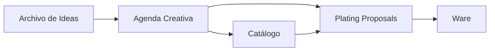
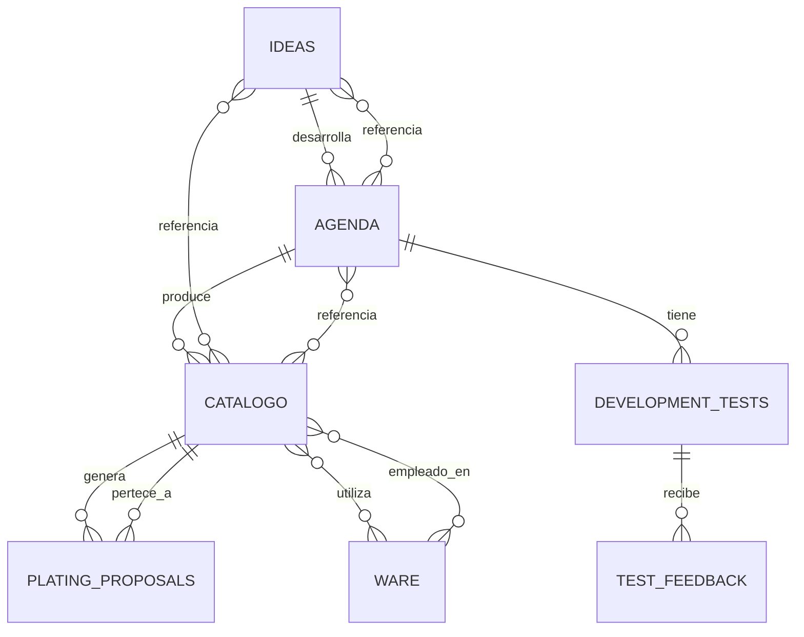

# PRODUCT_ARCHITECTURE_PROPOSAL — Transformar admin-web en herramienta de desarrollo

> Propuesta para evolucionar la app CRUD actual a una herramienta operativa
> que modele el flujo real: IDEA → CONCEPTO → PRUEBAS → VALIDACIÓN → PRODUCTO → EMPLATADO → VAJILLA.
>
> Documento para revisión de David antes de implementar tablas nuevas.

---

## 1. Problema

La app actual es **CRUD sobre tres entidades sueltas** (Ideas, Agenda, Catálogo).
El usuario (David) opera cada entidad de forma independiente y sin un
**modelo mental de flujo**. Para desarrollar un producto nuevo hoy:

- crear una idea suelta;
- abrir manualmente una agenda "Prueba panacotta" o similar;
- cambiar manualmente el contenido de los bloques cada vez;
- no hay forma de saber **en qué fase** está ese desarrollo;
- no hay historial (Prueba 1, Prueba 2 se mezclan);
- no hay feedback estructurado de mesas;
- no hay IA que sugiera emplatado o vajilla;
- no hay forma de **ver todo lo pendiente** de un vistazo.

David quiere que la app sea **el centro operativo** de ese flujo, no un
almacén de tablas.

---

## 2. Modelo funcional (lo que el usuario ve)

```
DESARROLLO DE PRODUCTO (unidad de trabajo = Agenda Creativa)
  │
  ├── Origen: Idea(s) relacionada(s)
  │
  ├── Estado del desarrollo (ciclo de vida)
  │     CONCEPTO → PRUEBA_1 → EVALUACION_1 → MODIFICACION → PRUEBA_2
  │     → VALIDACION → PRODUCTO
  │
  ├── Pruebas (historial)
  │     Prueba 1 (fecha, objetivo, resultado, observaciones)
  │     Prueba 2 (...)
  │
  ├── Feedback de mesa (1..N por prueba)
  │     Mesa 12 · 2 personas · valoración · observaciones
  │
  ├── Contenido libre (bloques existentes)
  │     receta tentativa, conceptos, notas
  │
  ├── Producto final (cuando se valida)
  │     → entrada en Catálogo (reutilizando datos)
  │     → receta estructurada final
  │
  ├── Emplatado con IA (después de producto final)
  │     3 propuestas almacenadas independientemente
  │
  └── Vajilla (después de emplatado elegido)
        Inventario real · 3 propuestas IA con explicación
```

---

## 3. Flujo completo (lo que David podrá hacer)

```
1. Abrir una IDEA del Archivo
       ↓
2. [CREAR CONCEPTO] → crea una Agenda con estado CONCEPTO
       ↓
3. Trabajar el concepto en bloques (receta tentativa, ideas, notas)
       ↓
4. [CREAR PRUEBA 1] → registra Prueba 1 (fecha, objetivo)
       ↓
5. Hacer la prueba → [REGISTRAR RESULTADO] (resultado, observaciones)
       ↓
6. [CREAR EVALUACIÓN] → 1-2 mesas, personas, fecha
       ↓
7. Recoger feedback → valora, observaciones por mesa
       ↓
8a. Si OK → [REGISTRAR MODIFICACIÓN] → estado MODIFICACION
       ↓
8b. Si HAY QUE AJUSTAR → volver a Prueba 1 modificada
       ↓
9. [CREAR PRUEBA 2] → Prueba 2 (nueva fila, conserva Prueba 1)
       ↓
10. Validar → CHECKLIST (pruebas hechas + receta + imagen definitiva)
       ↓
11. [CREAR PRODUCTO EN CATÁLOGO] → agenda pasa a PRODUCTO,
     crea fila en catalogos con datos pre-rellenados,
     relación agenda_catalogo automática
       ↓
12. [GENERAR PROPUESTAS DE EMPLATADO] → 3 propuestas IA
       ↓
13. David elige propuesta → estado ELEGIDA
       ↓
14. [ANALIZAR VAJILLA] → 3 propuestas IA con explicación
       ↓
15. David elige vajilla → estado ELEGIDA, relación catalogo_ware
       ↓
16. PRODUCTO COMPLETO en catálogo con todo su historial
```

---

## 4. Pantallas

### 4.1 Sidebar (nueva estructura)

```
SOL DE NIT

  DESARROLLO
    Pipeline          /desarrollo
    Pendientes        /pendientes

  CONTENIDO
    Ideas             /ideas
    Agenda            /agendas
    Catálogo          /catalogos

  ANÁLISIS
    Evaluaciones      /evaluaciones
    Emplatado         /emplatado
    Vajilla           /vajilla

  DOCUMENTACIÓN
    Cómo funciona     /documentacion
```

### 4.2 Pantalla `/desarrollo` — Pipeline

Vista tipo **Kanban**: 5 columnas = los 5 estados activos en curso.

```
┌──────────────────────────────────────────────────────────────────────┐
│ DESARROLLO DE PRODUCTOS                                              │
├────────────┬────────────┬────────────┬────────────┬────────────────┤
│ CONCEPTO   │ PRUEBA 1   │ EVALUACIÓN │ MODIFICACIÓN│ PRUEBA 2      │
├────────────┼────────────┼────────────┼────────────┼────────────────┤
│ [Tarjeta]  │ [Tarjeta]  │ [Tarjeta]  │ [Tarjeta]  │ [Tarjeta]     │
│ [Tarjeta]  │ [Tarjeta]  │            │ [Tarjeta]  │                │
│            │            │            │            │                │
├────────────┴────────────┴────────────┴────────────┴────────────────┤
│ VALIDACIÓN                │ PRODUCTO                              │
├───────────────────────────┼──────────────────────────────────────┤
│ [Tarjeta]                 │ [Tarjeta]                            │
│                           │                                      │
└───────────────────────────┴──────────────────────────────────────┘
```

**Tarjeta** muestra: nombre, imagen principal, días en estado, nº pruebas,
próxima acción sugerida. Click → ficha de desarrollo. Botón "+ Nuevo" crea
una Agenda en estado CONCEPTO.

### 4.3 Pantalla `/agendas/{id}` — Ficha de Desarrollo (enriquecida)

```
┌─────────────────────────────────────────────────────────────────────┐
│ PIZZA DE PATATA Y SETA                                 [✎] [🗑]    │
│ Estado: PRUEBA 2                                                 │
├─────────────────────────────────────────────────────────────────────┤
│ [📷 imagen principal]                                              │
├──────────────────┬──────────────────────────────────────────────────┤
│ ORIGEN           │ SIGUIENTE ACCIÓN                                │
│ → Idea: Pizza de │ [Registrar resultado de prueba 2]              │
│   otoño          │                                                  │
├──────────────────┴──────────────────────────────────────────────────┤
│ ESTADO DEL DESARROLLO                                              │
│ ✓ Concepto                                                         │
│ ✓ Prueba 1                                                         │
│ ✓ Evaluación 1                                                     │
│ ✓ Modificación                                                     │
│ ● Prueba 2 (en curso)                                              │
│ ○ Validación                                                       │
│ ○ Producto                                                         │
├─────────────────────────────────────────────────────────────────────┤
│ PRUEBAS                                                             │
│ ┌──────────┐ ┌──────────┐                                          │
│ │ Prueba 1 │ │ Prueba 2 │                                          │
│ │ 15/9     │ │ 22/9     │                                          │
│ │ Pendiente│ │ En curso │                                          │
│ └──────────┘ └──────────┘                                          │
├─────────────────────────────────────────────────────────────────────┤
│ FEEDBACK                                                           │
│ Mesa 12 · 19/9 · 2 personas · ⭐⭐⭐⭐                                │
├─────────────────────────────────────────────────────────────────────┤
│ CONTENIDO (bloques libres: receta tentativa, notas)                │
├─────────────────────────────────────────────────────────────────────┤
│ RELACIONES                                                         │
│ Ideas: Pizza de otoño                                              │
│ Catálogo: —                                                        │
└─────────────────────────────────────────────────────────────────────┘
```

### 4.4 Pantalla `/pendientes` — Panel de pendientes

Lista priorizada por color:

```
🔴 URGENTE
  · Pizza de setas — esperando feedback de mesa 12 (hace 3 días)
  · Panacotta — Prueba 2 sin resultado (hace 5 días)

🟠 HOY
  · Tomate escaldado — modificar receta y volver a probar
  · Carpaccio — registrar feedback de mesa 18

🟡 ESTA SEMANA
  · Pizza Burrata — pasar a validación (checklist)
  · Pizza Calabacin — validar receta definitiva

🟢 LISTO PARA PRODUCTO
  · Pizza de patata — checklist completo, falta crear producto en catálogo
```

### 4.5 Pantalla `/documentacion` — Documentación viva

```
# Cómo funciona el sistema creativo

## A. Visión general
[diagrama Mermaid]

## B. Flujo completo
IDEA → CONCEPTO → PRUEBA → EVALUACIÓN → MODIFICACIÓN → PRUEBA 2
     → VALIDACIÓN → PRODUCTO → EMPLATADO IA → VAJILLA

## C. Modelo de datos
[diagrama ER Mermaid]

## D. Ciclo de vida
[lista de estados con significado]

## E. Flujo de IA
RECETA → CONTEXTO → AGENTE IA → PROPUESTAS → ELECCIÓN

## F. Reglas del sistema
[qué significa cada estado, cuándo cambia, etc.]

## G. Historial de cambios
[cómo se rastrea cada cambio]
```

### 4.6 Otras pantallas nuevas

- `/evaluaciones` — listado de evaluaciones de mesa (filtrable por producto, fecha)
- `/emplatado` — propuestas de emplatado pendientes de revisión
- `/vajilla` — inventario de vajilla + CRUD

---

## 5. Estados del desarrollo

Propongo **7 estados** (alineados con el flujo de David):

```
CONCEPTO          → La idea está aterrizada. Sin pruebas todavía.
PRUEBA_1          → Primera prueba en cocina.
EVALUACION_1      → Evaluada en mesa (1-2 mesas, feedback recogido).
MODIFICACION      → Ajustes post-feedback. Receta modificada.
PRUEBA_2          → Segunda prueba con receta modificada.
VALIDACION        → Checklist + receta definitiva + imagen definitiva.
PRODUCTO          → Entrada en Catálogo creada.
```

**Decisión:** usar el campo `agendas.etiquetas` para el estado, o añadir un
campo nuevo `agendas.estado_desarrollo`.

**Recomendación:** **campo nuevo `estado_desarrollo`** (text). Razones:
- `etiquetas` ya existe y podría usarse, pero es multi-valor → inconsistente
  con un campo que es single-value
- Las migraciones de Notion no usan `etiquetas` → está vacío, reutilizarlo
  no aporta retro-compatibilidad
- Un campo explícito es más legible en queries, índices y lógica
- `ALTER TABLE ADD COLUMN` no es destructivo

---

## 6. Tablas existentes que se reutilizan (sin cambios)

| Tabla | Uso actual | Uso futuro |
|---|---|---|
| `ideas` | Origen conceptual | Igual + filtro por categorías |
| `agendas` | Centro "desarrollo" | Igual + nuevo `estado_desarrollo` |
| `catalogos` | Producto final | Igual + nuevo `receta_estructurada` (jsonb) |
| `agenda_blocks` | Receta tentativa en texto libre | Igual |
| `idea_blocks`, `catalogo_blocks` | Contenido | Igual |
| `idea_images`, `agenda_images`, `catalogo_images` | Imágenes | Igual |
| `idea_agenda`, `idea_catalogo`, `agenda_catalogo` | Relaciones | Igual |

---

## 7. Cambios al schema existente (mínimos, no destructivos)

### 7.1 `agendas` — añadir 2 columnas

```sql
ALTER TABLE notion_migration.agendas
  ADD COLUMN estado_desarrollo text
    CHECK (estado_desarrollo IN ('CONCEPTO','PRUEBA_1','EVALUACION_1',
                                 'MODIFICACION','PRUEBA_2','VALIDACION',
                                 'PRODUCTO') OR estado_desarrollo IS NULL),
  ADD COLUMN objetivo text,
  ADD COLUMN receta_final jsonb;

CREATE INDEX idx_agendas_estado
  ON notion_migration.agendas(estado_desarrollo);
```

- `estado_desarrollo`: ciclo de vida (default NULL = sin clasificar)
- `objetivo`: texto libre del objetivo del desarrollo
- `receta_final`: jsonb con `{ingredientes, cantidades, proceso, rendimiento, tiempos, temperaturas, montaje, observaciones}` — se rellena al validar

### 7.2 `catalogos` — añadir 1 columna

```sql
ALTER TABLE notion_migration.catalogos
  ADD COLUMN receta_estructurada jsonb;
```

- Replica de `receta_final` para catálogos históricos que NO pasaron por
  Agenda (algunos catálogos pueden existir sin agenda origen).

### 7.3 `development_events` — añadir 1 columna a `agendas`

(No es tabla nueva; añade eventos al JSON de la agenda como `agendas.timeline jsonb`)

```sql
ALTER TABLE notion_migration.agendas
  ADD COLUMN timeline jsonb DEFAULT '[]'::jsonb;
```

- Eventos append-only generados automáticamente al cambiar `estado_desarrollo`,
  crear pruebas, feedback, validación, etc.
- Estructura: `[{ts, tipo, desc, usuario_id, payload}]`

**Por qué no tabla nueva `development_events`:** todos los eventos viven dentro
del JSON de la agenda → 1 query, sin joins, lectura inmediata. Si en el futuro
se quiere query temporal global, se migra a tabla.

---

## 8. Tablas NUEVAS propuestas (requieren aprobación)

> Las tablas propuestas son las mínimas necesarias para soportar el flujo
> completo. Se crean en `notion_migration`, mismo schema que el resto.

### 8.1 `development_tests` — historial de pruebas

```sql
CREATE TABLE notion_migration.development_tests (
  id uuid PRIMARY KEY DEFAULT gen_random_uuid(),
  agenda_id uuid NOT NULL REFERENCES notion_migration.agendas(id) ON DELETE CASCADE,
  numero smallint NOT NULL,                -- 1, 2, 3...
  fecha date NOT NULL,
  objetivo text,
  estado text NOT NULL DEFAULT 'PENDIENTE'
    CHECK (estado IN ('PENDIENTE','REALIZADA','DESCARTADA')),
  resultado text,                          -- texto libre
  observaciones text,
  created_at timestamptz NOT NULL DEFAULT now(),
  updated_at timestamptz NOT NULL DEFAULT now(),
  UNIQUE (agenda_id, numero)
);
CREATE INDEX idx_dev_tests_agenda ON notion_migration.development_tests(agenda_id);
```

### 8.2 `test_feedback` — evaluaciones de mesa

```sql
CREATE TABLE notion_migration.test_feedback (
  id uuid PRIMARY KEY DEFAULT gen_random_uuid(),
  test_id uuid NOT NULL REFERENCES notion_migration.development_tests(id) ON DELETE CASCADE,
  mesa text,                               -- "Mesa 12", "Mesa 18" (sin identificar personas)
  num_personas smallint,
  valoracion smallint CHECK (valoracion BETWEEN 1 AND 5),
  observaciones text,
  fecha date NOT NULL,
  created_at timestamptz NOT NULL DEFAULT now()
);
CREATE INDEX idx_test_feedback_test ON notion_migration.test_feedback(test_id);
```

### 8.3 `plating_proposals` — propuestas de emplatado (IA)

```sql
CREATE TABLE notion_migration.plating_proposals (
  id uuid PRIMARY KEY DEFAULT gen_random_uuid(),
  catalogo_id uuid NOT NULL REFERENCES notion_migration.catalogos(id) ON DELETE CASCADE,
  descripcion text NOT NULL,
  contexto_usado jsonb,                    -- snapshot del input que se dio a la IA
  imagen_url text,
  estado text NOT NULL DEFAULT 'GENERADA'
    CHECK (estado IN ('GENERADA','EN_REVISION','DESCARTADA','ELEGIDA')),
  orden smallint NOT NULL,                 -- 1, 2, 3
  created_at timestamptz NOT NULL DEFAULT now(),
  UNIQUE (catalogo_id, orden)
);
```

- 3 propuestas por catálogo, NO se sobrescriben.
- Si David pide regenerar, se crean nuevas con orden distinto.

### 8.4 `ware` — inventario de vajilla

```sql
CREATE TABLE notion_migration.ware (
  id uuid PRIMARY KEY DEFAULT gen_random_uuid(),
  nombre text NOT NULL,
  tipo text NOT NULL,                       -- plato, bowl, copa, fuente, cuchara, etc.
  marca text,
  modelo text,
  material text,
  color text,
  forma text,                              -- redondo, cuadrado, orgánico
  textura text,
  tamano text,                              -- "26cm", "300ml"
  disponibilidad boolean NOT NULL DEFAULT true,
  imagen_bucket text,
  imagen_path text,
  created_at timestamptz NOT NULL DEFAULT now(),
  updated_at timestamptz NOT NULL DEFAULT now()
);
```

- Empezará vacía. David la rellena desde la UI (`/vajilla`).

### 8.5 `catalogo_ware` — relación N:M catálogo↔vajilla

```sql
CREATE TABLE notion_migration.catalogo_ware (
  catalogo_id uuid NOT NULL REFERENCES notion_migration.catalogos(id) ON DELETE CASCADE,
  ware_id uuid NOT NULL REFERENCES notion_migration.ware(id) ON DELETE CASCADE,
  estado text NOT NULL DEFAULT 'PROPUESTA'
    CHECK (estado IN ('PROPUESTA','ELEGIDA','DESCARTADA')),
  propuesta_numero smallint,               -- qué nº de propuesta de IA sugirió esta vajilla
  explicacion text,                        -- por qué la IA la propuso
  created_at timestamptz NOT NULL DEFAULT now(),
  PRIMARY KEY (catalogo_id, ware_id)
);
```

---

## 9. Flujo IA

### 9.1 Endpoint backend: `/api/ai/plating/{catalogo_id}`

```python
POST /api/ai/plating/{catalogo_id}
Body: (opcional) { "context_extra": "..." }
Response: { "proposals": [
    { "id": "uuid", "orden": 1, "descripcion": "...", "imagen_url": null, "estado": "GENERADA" }
]}
```

**Backend llama a MiniMax API (MiniMax-M3) con contexto:**

```
Eres un chef creativo de una pizzería mediterránea en Cataluña.

Producto: {catalogo.titulo}
Categoría: {catalogo.categorias}
Ingredientes: {catalogo.ingredientes}
Receta final: {catalogo.receta_estructurada}
Contexto del desarrollo: {agenda.objetivo}
Restricciones: restaurante abierto viernes+sábado, ticket medio 20-25€,
                emplatado debe salir en ≤6min desde pedido.

Genera 3 propuestas de emplatado DIFERENCIADAS entre sí. Cada una con:
- nombre (ej: "Emplatado clásico de pizzería", "Emplatado minimalista blanco")
- descripción (2-3 frases, tono profesional)
- vajilla sugerida (tipo de plato, color, forma)
- razonamiento (por qué encaja con el producto)

Responde en JSON estricto:
[
  {"nombre": "...", "descripcion": "...", "vajilla": "...", "razonamiento": "..."},
  ...
]
```

**Backend:**
1. Construye contexto desde la DB.
2. Llama a `MiniMax API /v1/chat/completions` con `model=MiniMax-M3`.
3. Parsea JSON, valida, inserta 3 filas en `plating_proposals` con `orden=1,2,3`.
4. Devuelve IDs.

### 9.2 Endpoint: `/api/ai/ware/{catalogo_id}`

Similar. Pide 3 propuestas de vajilla para el producto+emplatado elegido.

```
Recibe:
- producto (receta, ingredientes)
- propuesta de emplatado elegida
- inventario completo de ware

Genera 3 combinaciones DIFERENTES de vajilla para servir este plato.
Cada propuesta con: lista de piezas (nombre ware_id o nombre), explicación
de por qué encaja, presentación (clásica/moderna/rústica/etc.)
```

**Backend:**
1. Lee `ware` completo.
2. Lee el producto y propuesta de emplatado elegida.
3. Llama a IA.
4. Inserta N filas en `catalogo_ware` con `estado='PROPUESTA'` y `propuesta_numero=N`.

### 9.3 Seguridad IA

- API key `MINIMAX_API_KEY` se añade a `backend/.env` (sin service_role).
- Endpoint IA: solo accesible si la app está logueada (cuando se active auth).
- Rate limit: máximo 1 llamada / 10 segundos por sesión.

---

## 10. UX decisiones

### 10.1 Lo que sí
- **Drag & drop** en Pipeline entre columnas (con validación: solo
  transiciones válidas, ej: CONCEPTO → PRUEBA_1 OK; CONCEPTO → PRODUCTO NO).
- **Próxima acción** contextual: cada estado muestra un botón claro con la
  siguiente acción lógica.
- **Indicadores de tiempo** en cada tarjeta (días en estado, próxima prueba).
- **Búsqueda global** en el topbar (busca en Ideas + Agendas + Catálogo).
- **Vista móvil**: sidebar colapsable, tarjetas en columna única.

### 10.2 Lo que NO
- Sin formularios gigantes: edición inline donde sea posible.
- Sin modales dentro de modales.
- Sin "guardar y cerrar" — autosave en cambios pequeños.
- Sin jerga técnica visible para el usuario (no "FK", "storage_path",
  "constraint" — sí "imagen", "estado", "prueba").

---

## 11. Diagramas (Mermaid, generados desde modelo real)

### 11.1 Flujo de desarrollo



### 11.2 Modelo de datos (ER)



(Diagrama final se ajustará tras implementación, no se publica hasta validar contra DB.)

---

## 12. Lo que se reutiliza (resumen)

| Componente existente | Reutilización |
|---|---|
| Backend FastAPI | Se extiende con nuevos endpoints (no se rehace) |
| Frontend SPA | Se añaden vistas; sidebar se reorganiza |
| Storage `notion-migration-staging` | Se reutiliza para imágenes de ware |
| Signed URLs | Se reutiliza para ware también |
| Whitelist + escape SQL | Se aplica a nuevas queries |
| Encoding fix | Se aplica a datos nuevos |
| Modal confirm/imagen | Se reutiliza |
| `api.js` cliente HTTP | Se reutiliza y se añaden métodos |
| Service-role solo en backend | Mantenido |
| `auth.py` skeleton | Sigue disponible |

---

## 13. Lo que se modifica

- `agendas` (3 columnas nuevas)
- `catalogos` (1 columna nueva)
- `main.py` (nuevos endpoints)
- `queries.py` (funciones nuevas)
- Frontend: nuevo sidebar, nuevas vistas
- `README.md` (sección de features)

---

## 14. Lo que se añade

- 5 tablas nuevas (sección 8)
- Endpoints backend:
  - `GET /api/desarrollo/pipeline`
  - `PATCH /api/agendas/{id}/estado`
  - `POST /api/agendas/{id}/tests`
  - `PATCH /api/tests/{id}`
  - `POST /api/tests/{id}/feedback`
  - `POST /api/catalogos/{id}/validar`
  - `POST /api/ai/plating/{catalogo_id}`
  - `POST /api/ai/ware/{catalogo_id}`
  - `GET /api/ware`, `POST /api/ware`, `PATCH /api/ware/{id}`, `DELETE /api/ware/{id}`
  - `GET /api/pendientes`
- Frontend:
  - `/desarrollo` (Pipeline)
  - `/agendas/{id}` enriquecida (Ficha de Desarrollo)
  - `/pendientes`
  - `/evaluaciones`
  - `/emplatado`
  - `/vajilla`
  - `/documentacion`
- Integración MiniMax API

---

## 15. Riesgos

1. **IA puede dar respuestas inconsistentes** (idioma, formato JSON).
   Mitigación: validación estricta del JSON, retry con prompt reforzado,
   fallback con mensaje claro al usuario.

2. **MiniMax API key fija/no rotable** (problema conocido del proyecto).
   Mitigación: monitoreo manual desde panel de MiniMax.

3. **Rate limits del Management API SQL** durante carga inicial de Pipeline.
   Mitigación: cachear `/desarrollo/pipeline` 30s; paginación agresiva.

4. **Tablas nuevas afectan FK CASCADE**: si David borra una agenda, se
   borran sus tests + feedback. Es comportamiento correcto y esperado.

5. **Performance del frontend**: la ficha de desarrollo pide muchos datos.
   Mitigación: endpoint consolidado `/api/agendas/{id}/desarrollo` que
   devuelve todo en una query.

6. **Datos de vajilla vacíos al inicio**: la IA no puede recomendar sin
   inventario. Mitigación: `/vajilla` con importador CSV si David tiene
   lista externa.

7. **Recetas en `agenda_blocks` son texto libre**: no se pueden convertir
   automáticamente a receta estructurada. Mitigación: David rellena el
   formulario de receta estructurada al validar (no auto-conversión).

---

## 16. Plan de implementación por fases

| Fase | Entregable | Bloquea? |
|---|---|---|
| 1 | `docs/CURRENT_SYSTEM.md` | — |
| 2 | `docs/PRODUCT_ARCHITECTURE_PROPOSAL.md` (este doc) | — |
| 3 | `docs/PRODUCT_WORKFLOW.md` + `DATA_MODEL.md` + `AI_WORKFLOW.md` + `USER_GUIDE.md` + diagramas Mermaid + página `/documentacion` | — |
| 4 | Pipeline `/desarrollo` (sin tablas nuevas, solo lectura) | — |
| 5 | Ficha de Desarrollo en `/agendas/{id}` (enriquecida con `estado_desarrollo` ya rellenable) | — |
| 6 | Pruebas + Feedback (REQUIERE tablas `development_tests`, `test_feedback`) | ⚠ Necesita aprobación |
| 7 | Validación → Catálogo (sin tablas nuevas, usa ALTER + lógica) | — |
| 8 | Emplatado IA (REQUIERE `plating_proposals`) | ⚠ Necesita aprobación |
| 9 | Vajilla (REQUIERE `ware`, `catalogo_ware`) | ⚠ Necesita aprobación |
| 10 | Panel `/pendientes` | — |
| 11 | Validación final contra Supabase | — |

**Bloqueos:** las fases 6, 8 y 9 requieren ALTER/CREATE TABLE. **Necesito
aprobación explícita** antes de crearlas. Las ALTER (no destructivas, sección 7)
las aplico al final, tras validar que los tests pasen.

---

## 17. Preguntas para David

1. **¿Apruebas las 5 tablas nuevas** (`development_tests`, `test_feedback`, `plating_proposals`, `ware`, `catalogo_ware`)?
2. **¿Apruebas los 3 ALTER TABLE** no destructivos en `agendas` y `catalogos`?
3. **¿La IA usa MiniMax API** (ya disponible) o prefieres otra?
4. **¿El inventario de vajilla empieza vacío** y David lo rellena desde la UI?
5. **¿El drag & drop** es required o basta con botones para cambiar estado?
6. **¿Hay límite de pruebas** por desarrollo o ilimitado?

---

## 18. Criterio de éxito

La app está terminada cuando David puede trabajar **un producto de principio
a fin sin salir de la ficha de desarrollo**, con todo el historial trazado,
las relaciones automáticas y la IA proponiendo emplatado + vajilla con
explicación.
